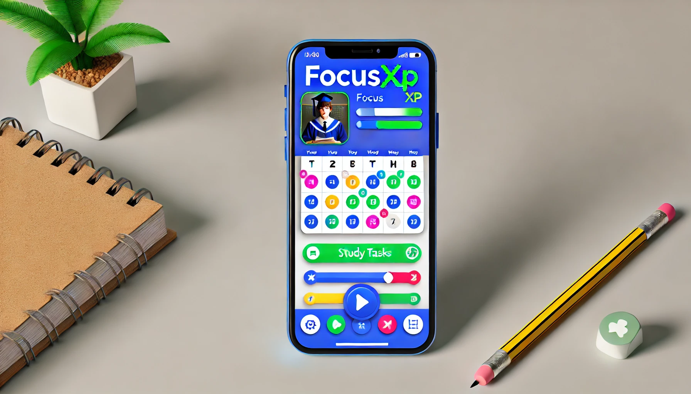

## Einführung in FocusXP - Teammitglieder: Markus Schoder / Steven Ou

Jedem von uns ist es schon in der Schulzeit passiert, dass wir einmal Termine übersehen oder für den anstehenden Test nicht genug gelernt haben. Hier kommt nun "FocusXP" ins Spiel, diese App soll die Schüler darin unterstützen. 

Das main aim dieses Projektes ist es, dass wir Schülern/Studenten die Möglichkeit bieten wollen, dass diese in einem Kalender alle Termine eintragen, damit diese nie wieder vergessen oder übersehen werden. Basierend auf die Eintragung des Tests/Schularbeit wird dann ein Lernplan erstellt, welcher den Schüler dabei helfen soll, früh genug mit dem lernen anzufangen.

(In Bearbeitung)

## Inhaltsverzeichnis

## 

